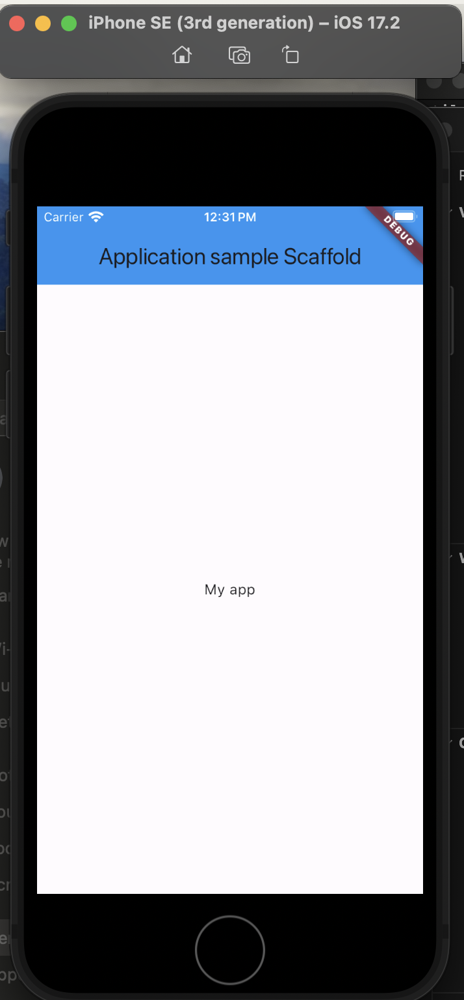
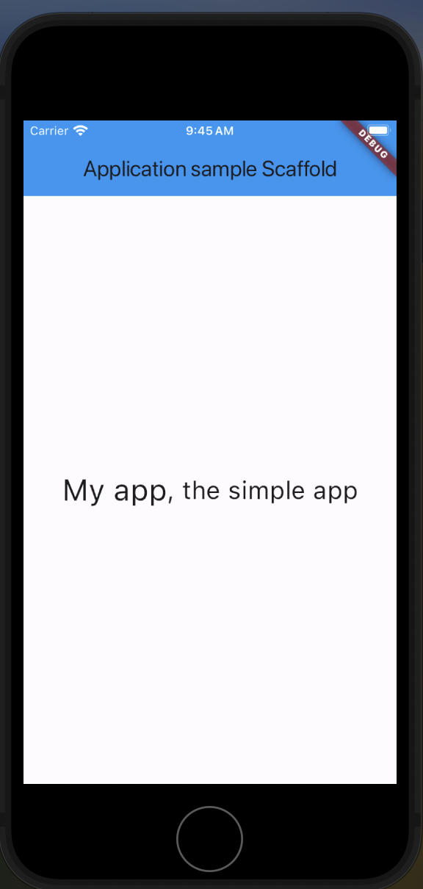
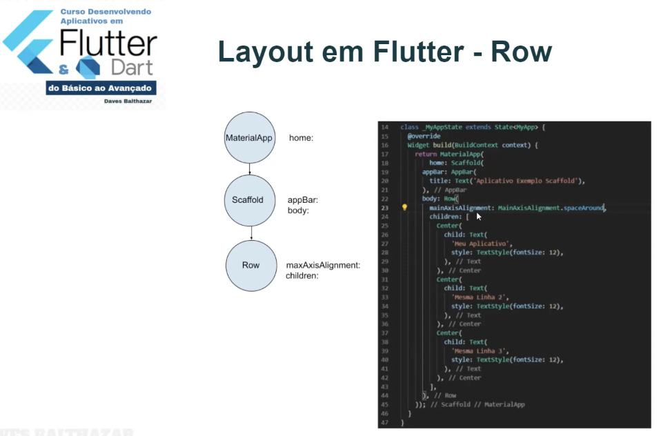
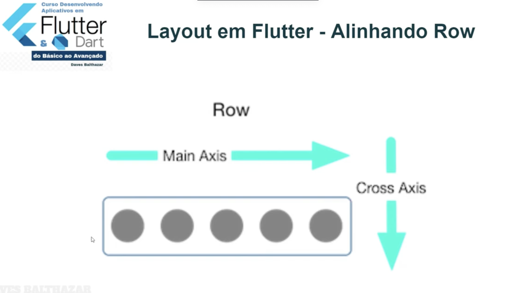
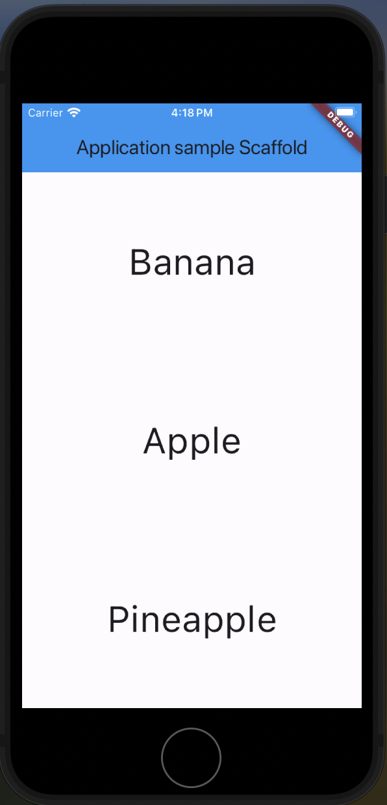
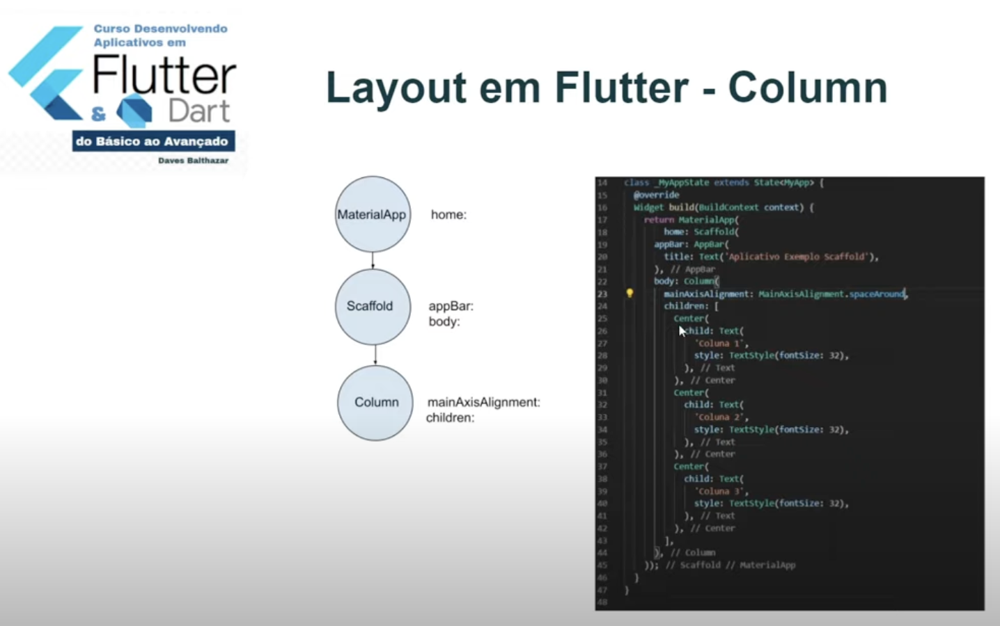
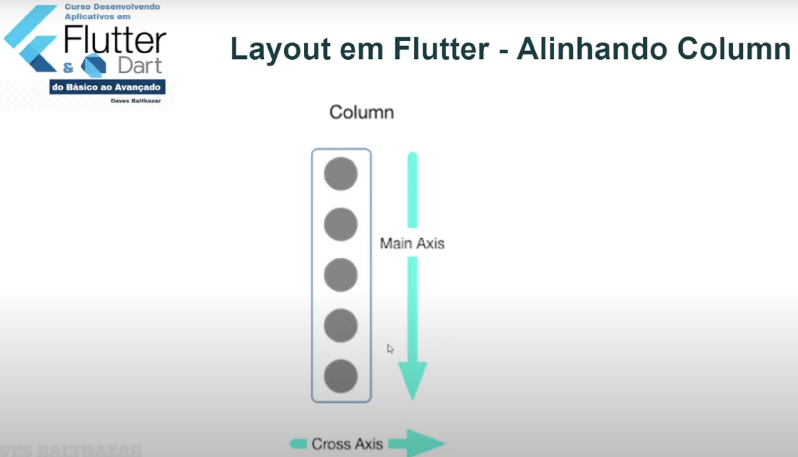

# flutter_layout_scaffold

### Layout 1
Using Scaffold (pt andaime), we build a widget with title and color (on appBar attribute) and text body (on the body attribute).

### Layout 2
Using mainAxisAlignment, which aligns each element in the row. Possible values: start, end, center, spaceBetween, spaceArround, spaceEvenly.

 

Important: In the row, Main Axis is horizontally alignment and Cross Axis is the vertically alignment.

### Layout 3
Using mainAxisAlignment, which aligns each element in the column. Possible values: start, end, center, spaceBetween, spaceArround, spaceEvenly.

 

Important: In the column, Main Axis is vertically alignment and Cross Axis is the horizontally alignment.

